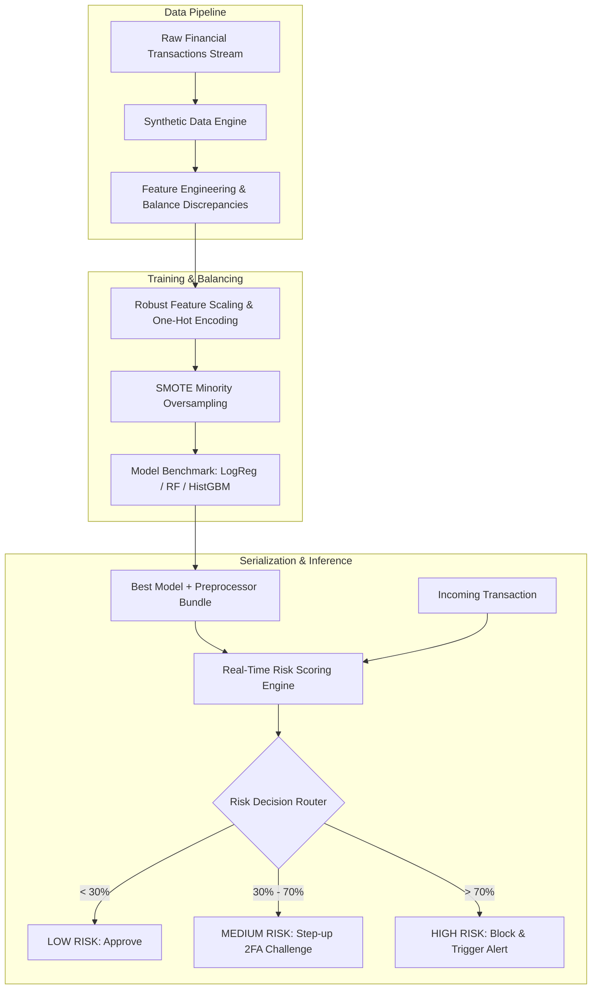
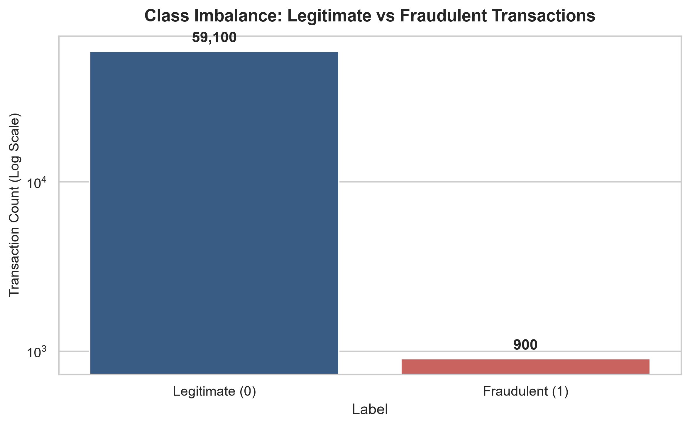
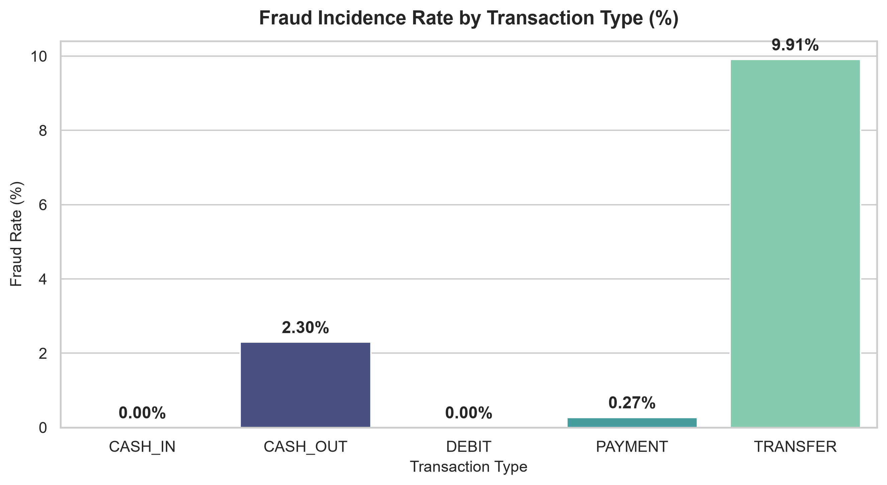
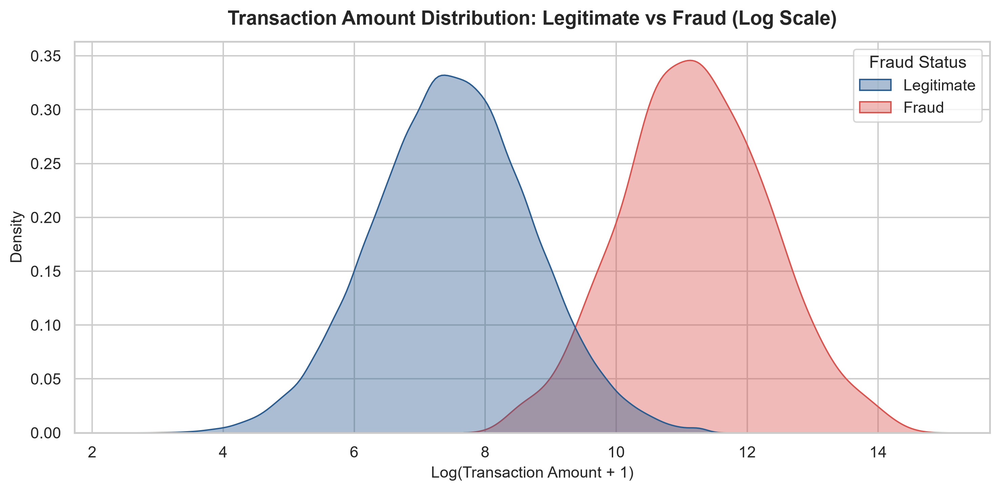
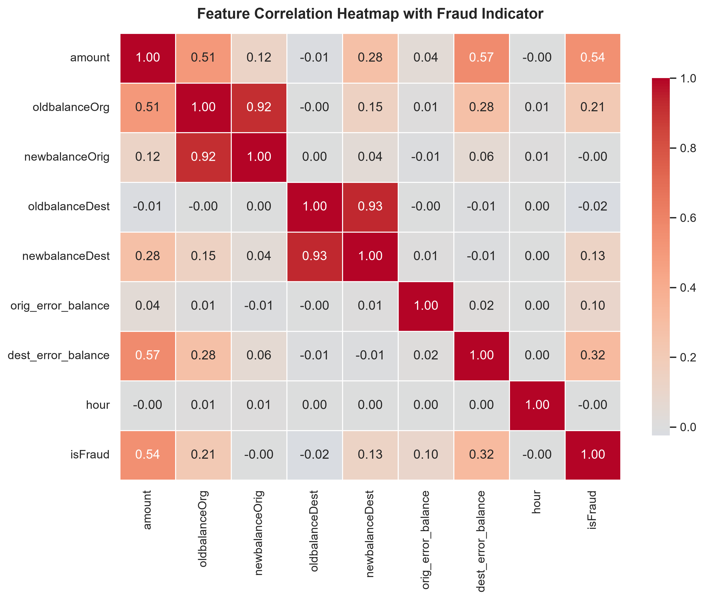
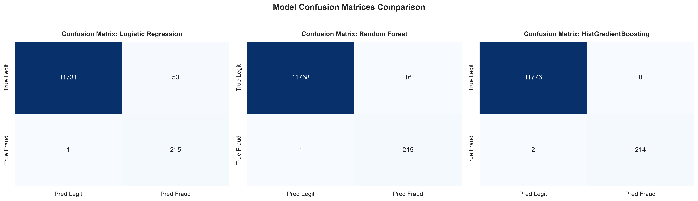
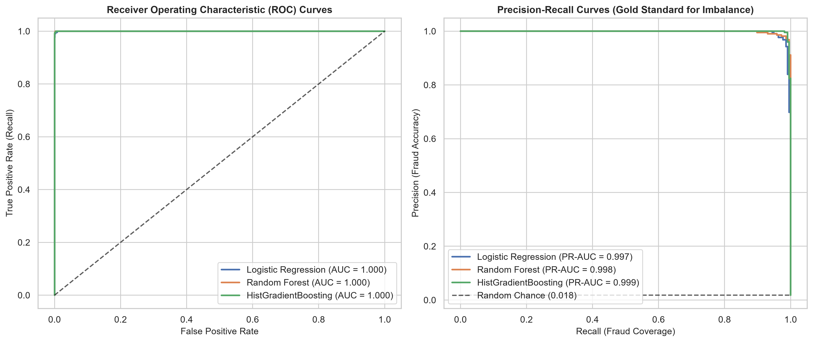
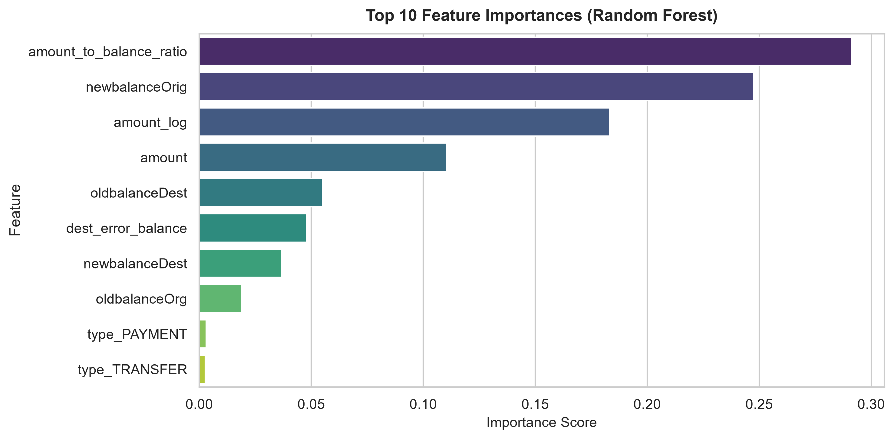

# End-to-End Financial Fraud Detection System

<p align="left">
  <a href="https://www.python.org/"></a>
  <a href="https://scikit-learn.org/"></a>
  <a href="https://pandas.pydata.org/"></a>
  <a href="https://numpy.org/"></a>
  <a href="https://imbalanced-learn.org/"></a>
  <a href="LICENSE"></a>
</p>

<p align="left">
  
</p>

A complete, production-grade Machine Learning system built with **Python**, **Scikit-Learn**, **Imbalanced-Learn (SMOTE)**, and **Seaborn** to detect, evaluate, and prevent financial transaction fraud in highly imbalanced payment environments.

---

## Table of Contents

- [Overview & Key Features](#overview--key-features)
- [System Architecture](#system-architecture)
- [Repository Structure](#repository-structure)
- [Exploratory Data Analysis & Visualizations](#exploratory-data-analysis--visualizations)
  - [1. Class Imbalance](#1-class-imbalance)
  - [2. Fraud Distribution by Transaction Type](#2-fraud-distribution-by-transaction-type)
  - [3. Transaction Amount Density](#3-transaction-amount-density)
  - [4. Financial Correlation Heatmap](#4-financial-correlation-heatmap)
- [Model Evaluation & Diagnostic Curves](#model-evaluation--diagnostic-curves)
  - [5. Model Confusion Matrices](#5-model-confusion-matrices)
  - [6. ROC & Precision-Recall Curves](#6-roc--precision-recall-curves)
  - [7. Feature Importance](#7-feature-importance)
- [Quick Start](#quick-start)
  - [1. Installation](#1-installation)
  - [2. Run Full Pipeline](#2-run-full-pipeline)
  - [3. Real-Time Transaction Inference](#3-real-time-transaction-inference)
- [Feature Engineering & Domain Rules](#feature-engineering--domain-rules)
- [Risk Decisioning & Action Tiers](#risk-decisioning--action-tiers)
- [Technical Documentation](#technical-documentation)
- [License](#license)

---

## Overview & Key Features

Financial fraud detection presents unique challenges: fraudulent transactions constitute less than 2% of overall volume, while false alarms create customer friction and false negatives lead to direct monetary loss.

This system addresses these challenges with an end-to-end architecture:
- **Realistic Transaction Engine**: Generates 60,000+ synthetic banking transactions with realistic balance manipulation, velocity spikes, and account draining mechanisms.
- **Advanced Feature Engineering**: Extracts temporal indicators, transaction-to-balance ratios, and sender/recipient balance discrepancy flags.
- **Severe Class Imbalance Mitigation**: Combines **SMOTE** (Synthetic Minority Over-sampling Technique) with **cost-sensitive balanced class weights**.
- **Multi-Model Benchmark**: Evaluates and compares **Logistic Regression**, **HistGradientBoosting**, and **Random Forest Classifiers**.
- **Fraud-Centric Evaluation**: Prioritizes **PR-AUC (Precision-Recall AUC)**, **Recall (Fraud Capture Rate)**, and confusion matrix diagnostics.
- **Real-Time Risk Scoring Engine**: An inference pipeline (`predict.py`) producing granular risk probabilities, risk scoring percentages, and operational automated actions (`APPROVE`, `2FA_CHALLENGE`, `BLOCK`).

---

## System Architecture



---

## Repository Structure

```
fraud_detection_system/
│
├── data/
│   ├── generate_data.py          # Synthetic realistic transaction data generator
│   └── transactions.csv          # Raw transaction dataset (60,000 records)
│
├── src/
│   ├── __init__.py               # Package initialization
│   ├── eda.py                    # Seaborn statistical visualization suite
│   ├── preprocessor.py           # Feature engineering, scaling & SMOTE pipeline
│   ├── models.py                 # Scikit-Learn classifiers & training routines
│   ├── evaluate.py               # Metrics, Confusion Matrices & ROC/PR curves
│   └── pipeline.py               # End-to-end orchestration pipeline
│
├── artifacts/
│   ├── plots/                    # High-resolution Seaborn diagnostic plots (.png)
│   │   ├── 01_class_imbalance.png
│   │   ├── 02_fraud_by_transaction_type.png
│   │   ├── 03_amount_distribution.png
│   │   ├── 04_correlation_heatmap.png
│   │   ├── 05_confusion_matrices.png
│   │   ├── 06_roc_and_pr_curves.png
│   │   └── 07_feature_importance.png
│   └── fraud_detector.joblib     # Serialized best model + preprocessor bundle
│
├── docs/
│   ├── ARCHITECTURE.md           # Deep-dive system architecture & design
│   ├── API_REFERENCE.md          # Code modules & class reference
│   └── EVALUATION.md             # In-depth diagnostic metrics & analysis
│
├── predict.py                    # Real-time transaction risk scoring & inference
├── main.py                       # Single command to train, evaluate & test
├── requirements.txt              # Project dependencies
├── .gitignore                    # Git ignore file
├── LICENSE                       # MIT License
└── README.md                     # Documentation & visual report
```

---

## Exploratory Data Analysis & Visualizations

### 1. Class Imbalance
The dataset reflects realistic payment environments where fraudulent transactions represent a minute fraction of overall volume.

<p align="center">
  
</p>

### 2. Fraud Distribution by Transaction Type
Analysis confirms that attackers concentrate fraud exclusively on capital liquidation vectors: **`TRANSFER`** and **`CASH_OUT`**.

<p align="center">
  
</p>

### 3. Transaction Amount Density
Kernel Density Estimation (KDE) demonstrating that legitimate transactions cluster in micro-to-medium payments, whereas fraudulent attempts exhibit right-skewed heavy-tailed values.

<p align="center">
  
</p>

### 4. Financial Correlation Heatmap
Correlation analysis highlighting strong predictive relationships between engineered balance errors (`orig_error_balance`, `dest_error_balance`), transaction amounts, and the fraud target.

<p align="center">
  
</p>

---

## Model Evaluation & Diagnostic Curves

### 5. Model Confusion Matrices
Comparative confusion matrix analysis across candidate models (**Logistic Regression**, **Random Forest**, and **HistGradientBoosting**), measuring True Positives, False Positives, and False Negatives.

<p align="center">
  
</p>

### 6. ROC & Precision-Recall Curves
Precision-Recall and ROC curves demonstrating model discriminatory capability across the full threshold spectrum.

<p align="center">
  
</p>

### 7. Feature Importance
Gini impurity-based feature importance ranking from the Random Forest ensemble, showing that engineered balance discrepancy features are the strongest discriminators.

<p align="center">
  
</p>

---

## Quick Start

### 1. Installation

Clone this repository and install the dependencies:

```bash
git clone https://github.com/SoulaymaneBoulaich/fraud-detection-system.git
cd fraud-detection-system
pip install -r requirements.txt
```

### 2. Run Full Pipeline

Execute the end-to-end pipeline (generates data, runs EDA, trains models, plots evaluation curves, and saves the trained bundle):

```bash
python main.py
```

### 3. Real-Time Transaction Inference

Score live sample transactions and observe risk-tier classification:

```bash
python predict.py
```

Sample output:
```text
======================================================================
      [INFERENCE] REAL-TIME TRANSACTION FRAUD SCORING ENGINE
======================================================================
Active Model Loaded: Random Forest

--- [Case 1] Routine Merchant Grocery Payment ---
Transaction : PAYMENT of $84.50
Probability : 0.09 (Risk Score: 9.0%)
Action      : [LOW RISK] APPROVE TRANSACTION

--- [Case 2] Routine Inter-Bank Transfer ---
Transaction : TRANSFER of $1,200.00
Probability : 0.00 (Risk Score: 0.0%)
Action      : [LOW RISK] APPROVE TRANSACTION

--- [Case 3] Suspicious Overnight Account Draining Transfer ---
Transaction : TRANSFER of $480,000.00
Probability : 1.00 (Risk Score: 100.0%)
Action      : [HIGH RISK] BLOCK & ALERT FRAUD TEAM

--- [Case 4] Fraudulent Instant Cash Out Attack ---
Transaction : CASH_OUT of $350,000.00
Probability : 1.00 (Risk Score: 100.0%)
Action      : [HIGH RISK] BLOCK & ALERT FRAUD TEAM
======================================================================
```

---

## Feature Engineering & Domain Rules

The feature pipeline calculates banking domain features:

| Feature Name | Calculation | Behavioral Signal |
| :--- | :--- | :--- |
| `orig_error_balance` | `newbalanceOrig + amount - oldbalanceOrg` | Flags unauthorized balance alterations and ledger mismatches. |
| `dest_error_balance` | `oldbalanceDest + amount - newbalanceDest` | Uncovers recipient mule account irregularities. |
| `amount_to_balance_ratio` | `amount / (oldbalanceOrg + 1)` | Captures account liquidation attempts. |
| `hour_of_day` | `step % 24` | Captures off-peak & late-night attack bursts. |
| `day_of_week` | `(step // 24) % 7` | Isolates weekend anomaly spikes. |
| `amount_log` | `log1p(amount)` | Corrects heavy-tailed monetary amounts. |

---

## Risk Decisioning & Action Tiers

The decision engine routes transactions based on calibrated risk probability thresholds:

| Risk Score | Tier | Automated Operational Action |
| :--- | :--- | :--- |
| **0.00% – 30.00%** | `LOW` | **APPROVE TRANSACTION** (Instant straight-through processing) |
| **30.01% – 70.00%** | `MEDIUM` | **2FA CHALLENGE** (Step-up authentication / OTP verification) |
| **70.01% – 100.00%** | `HIGH` | **BLOCK & ALERT** (Immediate transaction hold & fraud analyst escalation) |

---

## Technical Documentation

For deeper architectural and developer documentation, explore:
- [System Architecture Guide](docs/ARCHITECTURE.md) — Comprehensive technical architecture, pipelines, and mathematical formulations.
- [API Reference](docs/API_REFERENCE.md) — Module and function specifications with parameters and returns.
- [Evaluation & Diagnostics Report](docs/EVALUATION.md) — Model metrics, diagnostic plots, and PR curve interpretations.

---

## License

This project is open source and available under the [MIT License](LICENSE).
