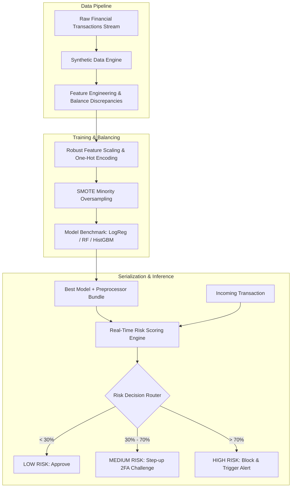

# End-to-End Financial Fraud Detection System

[](https://www.python.org/)
[](https://scikit-learn.org/)
[](https://imbalanced-learn.org/)
[](https://pandas.pydata.org/)
[](https://seaborn.pydata.org/)
[](LICENSE)

A complete, production-grade Machine Learning system built with **Python**, **Scikit-Learn**, **Imbalanced-Learn (SMOTE)**, and **Seaborn** to detect, evaluate, and prevent financial transaction fraud in highly imbalanced payment environments.

---

## Table of Contents

- [Overview & Key Features](#overview--key-features)
- [System Architecture](#system-architecture)
- [Repository Structure](#repository-structure)
- [Quick Start](#quick-start)
  - [1. Installation](#1-installation)
  - [2. Run Full Training & Evaluation Pipeline](#2-run-full-training--evaluation-pipeline)
  - [3. Run Real-Time Transaction Scoring Engine](#3-run-real-time-transaction-scoring-engine)
- [Feature Engineering & Domain Rules](#feature-engineering--domain-rules)
- [Visual Exploratory Data Analysis & Diagnostics](#visual-exploratory-data-analysis--diagnostics)
- [Machine Learning Models & Benchmark](#machine-learning-models--benchmark)
- [Risk Decisioning & Action Tiers](#risk-decisioning--action-tiers)
- [Technical Documentation Links](#technical-documentation-links)
- [License](#license)

---

## Overview & Key Features

Financial fraud detection presents unique challenges: fraudulent transactions constitute less than 2% of overall volume, while false alarms create customer friction and false negatives lead to severe monetary loss.

This system addresses these challenges with an end-to-end architecture:
- **Realistic Transaction Generator**: Generates 60,000+ synthetic banking transactions with realistic balance manipulation, velocity spikes, and account draining mechanisms.
- **Advanced Feature Engineering**: Extracts temporal indicators, transaction-to-balance ratios, and sender/recipient balance discrepancy flags.
- **Severe Class Imbalance Mitigation**: Combines **SMOTE** (Synthetic Minority Over-sampling Technique) with **cost-sensitive balanced class weights**.
- **Multi-Model Benchmark**: Evaluates and compares **Logistic Regression**, **HistGradientBoosting**, and **Random Forest Classifiers**.
- **Fraud-Centric Evaluation**: Prioritizes **PR-AUC (Precision-Recall AUC)**, **Recall (Fraud Capture Rate)**, and confusion matrix diagnostics.
- **Real-Time Risk Scoring Engine**: An inference pipeline (`predict.py`) producing granular risk probabilities, risk scoring percentages, and operational automated actions (`APPROVE`, `2FA_CHALLENGE`, `BLOCK`).

---

## System Architecture



---

## Repository Structure

```
fraud_detection_system/
│
├── data/
│   ├── generate_data.py          # Synthetic realistic transaction data generator
│   └── transactions.csv          # Raw transaction dataset (60,000 records)
│
├── src/
│   ├── __init__.py               # Package initialization
│   ├── eda.py                    # Seaborn statistical visualization suite
│   ├── preprocessor.py           # Feature engineering, scaling & SMOTE pipeline
│   ├── models.py                 # Scikit-Learn classifiers & training routines
│   ├── evaluate.py               # Metrics, Confusion Matrices & ROC/PR curves
│   └── pipeline.py               # End-to-end orchestration pipeline
│
├── artifacts/
│   ├── plots/                    # High-resolution Seaborn plots (.png)
│   │   ├── 01_class_imbalance.png
│   │   ├── 02_fraud_by_transaction_type.png
│   │   ├── 03_amount_distribution.png
│   │   ├── 04_correlation_heatmap.png
│   │   ├── 05_confusion_matrices.png
│   │   ├── 06_roc_and_pr_curves.png
│   │   └── 07_feature_importance.png
│   └── fraud_detector.joblib     # Serialized best model + preprocessor bundle
│
├── docs/
│   ├── ARCHITECTURE.md           # Deep-dive system architecture & design
│   ├── API_REFERENCE.md          # Code modules & class reference
│   └── EVALUATION.md             # In-depth diagnostic metrics & analysis
│
├── predict.py                    # Real-time transaction risk scoring & inference
├── main.py                       # Single command to train, evaluate & test
├── requirements.txt              # Project dependencies
├── .gitignore                    # Git ignore file
└── README.md                     # Documentation & usage manual
```

---

## Quick Start

### 1. Installation

Clone this repository and install the dependencies:

```bash
git clone https://github.com/SoulaymaneBoulaich/fraud-detection-system.git
cd fraud-detection-system
pip install -r requirements.txt
```

### 2. Run Full Training & Evaluation Pipeline

Execute the end-to-end pipeline (generates data, runs EDA, trains models, plots evaluation curves, and saves the trained bundle):

```bash
python main.py
```

### 3. Run Real-Time Transaction Scoring Engine

Score live sample transactions and observe risk-tier classification:

```bash
python predict.py
```

Sample output:
```text
======================================================================
      [INFERENCE] REAL-TIME TRANSACTION FRAUD SCORING ENGINE
======================================================================
Active Model Loaded: Random Forest

--- [Case 1] Routine Merchant Grocery Payment ---
Transaction : PAYMENT of $84.50
Probability : 0.09 (Risk Score: 9.0%)
Action      : [LOW RISK] APPROVE TRANSACTION

--- [Case 2] Routine Inter-Bank Transfer ---
Transaction : TRANSFER of $1,200.00
Probability : 0.00 (Risk Score: 0.0%)
Action      : [LOW RISK] APPROVE TRANSACTION

--- [Case 3] Suspicious Overnight Account Draining Transfer ---
Transaction : TRANSFER of $480,000.00
Probability : 1.00 (Risk Score: 100.0%)
Action      : [HIGH RISK] BLOCK & ALERT FRAUD TEAM

--- [Case 4] Fraudulent Instant Cash Out Attack ---
Transaction : CASH_OUT of $350,000.00
Probability : 1.00 (Risk Score: 100.0%)
Action      : [HIGH RISK] BLOCK & ALERT FRAUD TEAM
======================================================================
```

---

## Feature Engineering & Domain Rules

The feature pipeline calculates banking domain features:

| Feature Name | Calculation | Behavioral Signal |
| :--- | :--- | :--- |
| `orig_error_balance` | `newbalanceOrig + amount - oldbalanceOrg` | Flags unauthorized balance alterations and ledger mismatches. |
| `dest_error_balance` | `oldbalanceDest + amount - newbalanceDest` | Uncovers recipient mule account irregularities. |
| `amount_to_balance_ratio` | `amount / (oldbalanceOrg + 1)` | Captures account liquidation attempts. |
| `hour_of_day` | `step % 24` | Captures off-peak & late-night attack bursts. |
| `day_of_week` | `(step // 24) % 7` | Isolates weekend anomaly spikes. |
| `amount_log` | `log1p(amount)` | Corrects heavy-tailed monetary amounts. |

---

## Visual Exploratory Data Analysis & Diagnostics

All charts are saved into `artifacts/plots/`:

| Artifact | Description |
| :--- | :--- |
| **`01_class_imbalance.png`** | Demonstrates the acute class imbalance between legitimate and fraud cases. |
| **`02_fraud_by_transaction_type.png`** | Pinpoints high-risk fraud channels (`TRANSFER` and `CASH_OUT`). |
| **`03_amount_distribution.png`** | Seaborn KDE density plot comparing legitimate vs fraud amounts. |
| **`04_correlation_heatmap.png`** | Correlation matrix between balance errors, amounts, and fraud labels. |
| **`05_confusion_matrices.png`** | Side-by-side confusion matrices for all evaluated models. |
| **`06_roc_and_pr_curves.png`** | Precision-Recall & ROC curves benchmark. |
| **`07_feature_importance.png`** | Top predictive features according to the Random Forest ensemble. |

---

## Risk Decisioning & Action Tiers

The decision engine routes transactions based on calibrated risk probability thresholds:

| Risk Score | Tier | Automated Operational Action |
| :--- | :--- | :--- |
| **0.00% – 30.00%** | `LOW` | **APPROVE TRANSACTION** (Instant straight-through processing) |
| **30.01% – 70.00%** | `MEDIUM` | **2FA CHALLENGE** (Step-up authentication / OTP verification) |
| **70.01% – 100.00%** | `HIGH` | **BLOCK & ALERT** (Immediate transaction hold & fraud analyst escalation) |

---

## Technical Documentation Links

For more in-depth architectural and developer documentation, explore:
- [System Architecture Guide](docs/ARCHITECTURE.md) — Comprehensive technical architecture, pipelines, and mathematical formulations.
- [API Reference](docs/API_REFERENCE.md) — Module and function specifications with parameters and returns.
- [Evaluation & Diagnostics Report](docs/EVALUATION.md) — Model metrics, diagnostic plots, and PR curve interpretations.

---

## License

This project is open source and available under the [MIT License](LICENSE).
