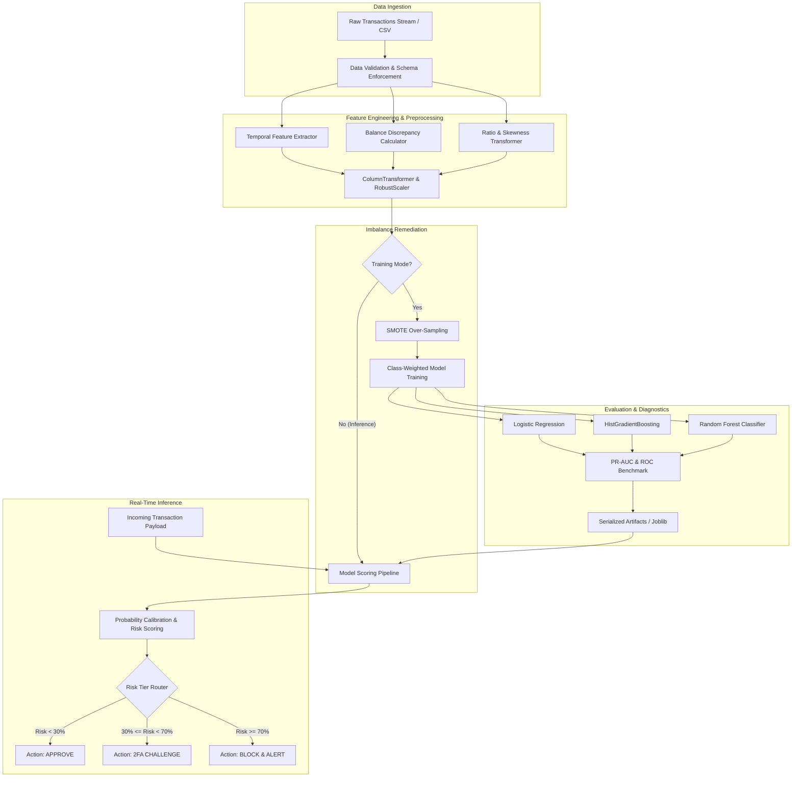

# System Architecture & Technical Design

## 1. High-Level Architecture

The Financial Fraud Detection System is designed as an end-to-end, production-oriented machine learning solution for high-throughput, imbalanced financial transaction environments.

---

## 2. Data Engineering & Simulation Engine

The data generation module (`data/generate_data.py`) simulates realistic multi-channel banking transactions across five core transaction types:
- `PAYMENT`
- `TRANSFER`
- `CASH_OUT`
- `DEBIT`
- `CASH_IN`

### Synthetic Fraud Injection Mechanisms:
1. **Account Draining Attacks**: Large amounts relative to the account balance, typically routed via `TRANSFER` or `CASH_OUT`.
2. **Balance Discrepancies**: Inconsistencies where `newbalanceOrig` does not equal `oldbalanceOrg - amount`.
3. **Temporal Burst / Off-Peak Spikes**: Fraudulent activity disproportionately executed during late-night or non-business hours.

---

## 3. Feature Engineering Pipeline

The feature engineering layer (`src/preprocessor.py`) creates behavioral indicators specifically tailored for fraud patterns:

| Feature Name | Formulation | Operational Rationale |
| :--- | :--- | :--- |
| `orig_error_balance` | `newbalanceOrig + amount - oldbalanceOrg` | Detects unauthorized balance adjustments or account manipulation. |
| `dest_error_balance` | `oldbalanceDest + amount - newbalanceDest` | Uncovers destination mule accounts receiving unauthorized credits. |
| `amount_to_balance_ratio` | `amount / (oldbalanceOrg + 1)` | Measures percentage of capital liquidated in a single operation. |
| `hour_of_day` | `step % 24` | Captures circadian velocity patterns and off-hours vulnerability. |
| `day_of_week` | `(step // 24) % 7` | Isolates weekend and holiday fraud bursts. |
| `amount_log` | `log1p(amount)` | Stabilizes heavy-tailed financial distributions for linear/tree models. |

---

## 4. Class Imbalance Remediation Strategy

Financial fraud datasets are notoriously imbalanced (< 2% positive cases). Standard classification objectives fail because a naive model predicting 100% negative achieves 98%+ accuracy while missing 100% of fraud.

This system applies a dual-pronged strategy:
1. **SMOTE (Synthetic Minority Over-sampling Technique)**: Generates synthetic fraud samples along the feature space line segments connecting $k$-nearest neighbors during training.
2. **Cost-Sensitive Learning (`class_weight='balanced'`)**: Penalizes false negatives (missed fraud) significantly higher than false positives (inconvenient 2FA prompts).

---

## 5. Inference & Decision Engine

The inference module (`predict.py`) exposes a low-latency scoring interface:
- **Low Risk (0.0% – 30.0%)**: `APPROVE` — Instant straight-through processing.
- **Medium Risk (30.1% – 70.0%)**: `2FA_CHALLENGE` — Friction-based verification (SMS OTP / Biometric step-up).
- **High Risk (70.1% – 100.0%)**: `BLOCK & ALERT` — Immediate transaction termination and routing to fraud analyst queue.
